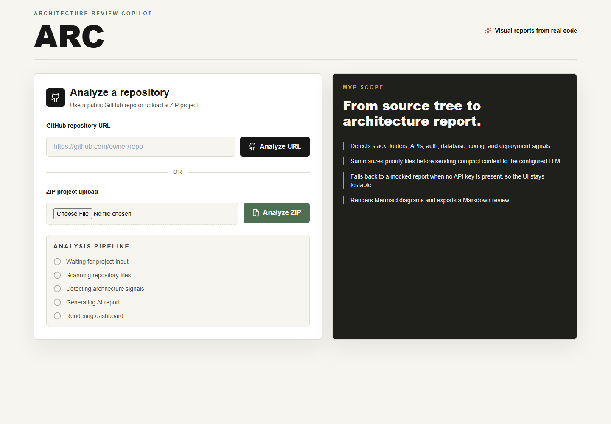
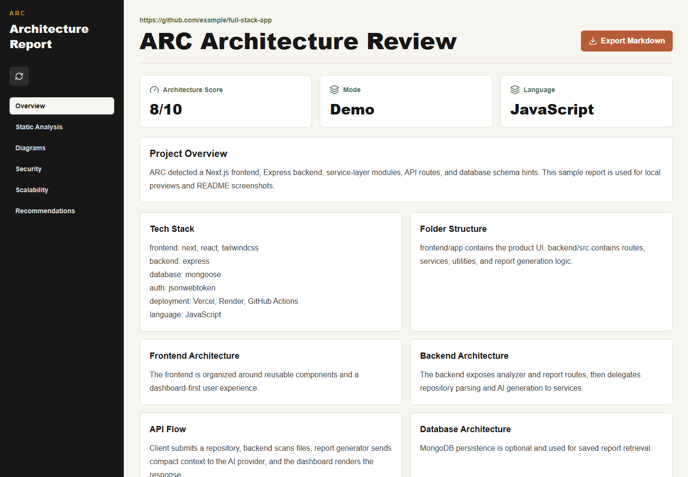

# ARC - Architecture Review Copilot

**ARC turns a public GitHub repository or uploaded ZIP project into a visual architecture review.**

It scans project structure, detects architecture signals, builds compact RAG evidence, sends the right context to a configurable AI provider, and renders a clean dashboard with insights, risks, recommendations, Mermaid diagrams, citations, repo chat, and Markdown export.

> **Disclaimer:** This entire project will later be shifted to Python and a deeper RAG system.

---

## Quick View

| Area | Details |
| --- | --- |
| Project name | ARC - Architecture Review Copilot |
| Input modes | Public GitHub repository URL, uploaded ZIP project |
| Output | Visual architecture report with diagrams, scores, issues, recommendations, and citations |
| Frontend | Next.js, React, Tailwind CSS, Mermaid.js, Lucide React |
| Backend | Node.js, Express, Multer, AdmZip, simple-git, Axios |
| AI providers | OpenAI, Gemini, Groq |
| RAG | Chunking, keyword retrieval, local/Gemini embeddings, in-memory vector retrieval |
| Database | Optional MongoDB for saved reports |
| Language | JavaScript only |

---

## Preview

### Landing and Analysis Pipeline



### Architecture Report Dashboard



---

## Table of Contents

- [Features](#features)
- [Tech Stack](#tech-stack)
- [Project Structure](#project-structure)
- [How ARC Works](#how-arc-works)
- [Requirements](#requirements)
- [Environment Setup](#environment-setup)
- [Installation](#installation)
- [Running Locally](#running-locally)
- [Deployment](#deployment)
- [Production Build Checks](#production-build-checks)
- [Continuous Integration](#continuous-integration)
- [API Reference](#api-reference)
- [Report Dashboard](#report-dashboard)
- [Demo Mode](#demo-mode)
- [Error Handling](#error-handling)
- [Security Scanner](#security-scanner)
- [Phase 1 RAG Layer](#phase-1-rag-layer)
- [Mermaid Diagram Handling](#mermaid-diagram-handling)
- [Current MVP Limitations](#current-mvp-limitations)
- [Security Notes](#security-notes)
- [Troubleshooting](#troubleshooting)
- [Roadmap](#roadmap)

---

## Features

### Repository Input

- Analyze a public GitHub repository URL.
- Analyze an uploaded ZIP project.
- Ignore generated or heavy folders such as `node_modules`, `.git`, `.next`, `dist`, `build`, `coverage`, and cache directories.
- Prioritize high-signal files such as `package.json`, README files, routes, controllers, services, models, middleware, config, auth, database, and deployment files.

### Architecture Detection

- Detect frontend, backend, database, auth, services, configuration, deployment, and API signals.
- Extract route/API maps from Express, Next.js route handlers, and Next.js pages API files.
- Extract relative import signals for a lightweight dependency graph.
- Detect database schema hints from Prisma, Mongoose, Sequelize, and SQL files.

### Security and Scoring

- Run deterministic security checks for hardcoded secrets, committed env files, permissive CORS, missing rate limits, missing security headers, upload risks, validation gaps, literal JWT secrets, and dynamic code execution.
- Generate category-level score breakdowns for security, scalability, maintainability, performance, deployment, and documentation.

### RAG and AI

- Build a Phase 1 RAG evidence layer with repository chunking, keyword retrieval, section-specific evidence, embeddings, vector retrieval, and source citations.
- Ask questions about the analyzed repository through an RAG-powered chat interface.
- Use OpenAI, Gemini, or Groq through environment variables.
- Use local hash embeddings by default for RAG chat, with optional Gemini embeddings.
- Fall back to demo mode when no AI key is configured.

### Report Output

ARC generates a structured architecture report with:

- project overview
- detected tech stack
- folder structure explanation
- frontend architecture
- backend architecture
- API flow
- database architecture
- authentication flow
- deployment readiness
- security issues
- scalability issues
- performance issues
- recommendations
- architecture score out of 10
- score breakdown by category

### Visual Diagrams

ARC renders Mermaid diagrams for:

- system architecture
- API request flow
- authentication flow
- database relationship
- deployment architecture

It also supports:

- copying Mermaid diagram source
- exporting the generated report as Markdown
- optionally saving generated reports with MongoDB
- showing an analysis progress timeline while scanning and generating a report

---

## Tech Stack

| Layer | Technologies |
| --- | --- |
| Frontend | Next.js, React, Tailwind CSS, Mermaid.js, Lucide React icons |
| Backend | Node.js, Express, Multer, AdmZip, simple-git, Axios |
| Optional database | MongoDB with Mongoose |
| AI providers | OpenAI, Gemini, Groq |
| RAG retrieval | Repository chunks, keyword retrieval, local/Gemini embeddings, in-memory vector store |

### AI Provider Auto-Selection

If `AI_PROVIDER` is left blank, ARC automatically chooses an available provider in this order:

1. Groq
2. Gemini
3. OpenAI

---

## Project Structure

```text
arc/
  backend/
    src/
      data/
        mockReport.js
      routes/
        analyze.js
        report.js
      services/
        repoAnalyzer.js
        reportGenerator.js
        reportStore.js
      utils/
        projectScanner.js
      server.js
    package.json

  frontend/
    app/
      report/
        page.js
      globals.css
      layout.js
      page.js
    components/
      AnalyzeForm.js
      MermaidDiagram.js
      ReportDashboard.js
    lib/
      api.js
    package.json

  .env.example
  .gitignore
  README.md
```

---

## How ARC Works

1. The user submits either a GitHub repository URL or a ZIP project.
2. The backend clones the public repository or extracts the ZIP into a temporary directory.
3. The scanner walks the project while skipping generated, binary, cache, and heavy folders.
4. ARC detects stack signals from dependency files and important project paths.
5. ARC extracts static analysis signals such as route maps, dependency edges, and database schema hints.
6. ARC runs deterministic security checks that do not depend on the AI model.
7. ARC creates a category-level score breakdown from static signals and report evidence.
8. ARC chunks high-priority files and classifies chunks as docs, route, controller, service, model, schema, auth, database, config, frontend, or source.
9. ARC retrieves section-specific evidence for overview, frontend, backend, API flow, database, authentication, security, scalability, performance, deployment, and diagrams.
10. The report generator sends compact RAG evidence and citations to the configured AI provider.
11. The AI returns structured JSON containing report sections, issues, recommendations, score, Mermaid diagrams, and citations.
12. The backend sanitizes diagrams and provides fallback Mermaid when the AI returns invalid or plain-text diagrams.
13. The frontend renders the dashboard and allows the user to inspect citations, copy diagrams, or export Markdown.

---

## Requirements

- Node.js 18 or newer
- npm
- Git installed and available in your terminal
- Optional: MongoDB connection string if you want saved report retrieval

---

## Environment Setup

Create an environment file from the example:

```bash
cp .env.example .env
```

On Windows PowerShell:

```powershell
Copy-Item .env.example .env
```

Example configuration:

```env
# Backend
PORT=5000
FRONTEND_URL=http://localhost:3000

# AI provider: openai, gemini, or groq
AI_PROVIDER=
OPENAI_API_KEY=
OPENAI_MODEL=gpt-4o-mini
GEMINI_API_KEY=
GEMINI_MODEL=gemini-2.5-flash
GROQ_API_KEY=
GROQ_MODEL=llama-3.3-70b-versatile

# RAG embeddings: local or gemini
EMBEDDING_PROVIDER=local
GEMINI_EMBEDDING_MODEL=text-embedding-004

# Optional persistence
MONGODB_URI=

# Frontend
NEXT_PUBLIC_API_URL=http://localhost:5000
```

### AI Provider Notes

To force a specific provider, set `AI_PROVIDER`:

```env
AI_PROVIDER=groq
```

Valid values:

- `groq`
- `gemini`
- `openai`

If no provider key is configured, ARC runs in demo mode and returns a mocked architecture report. This is useful for testing the UI without consuming API credits.

### Embedding Provider Notes

ARC's repository chat uses embeddings for vector-style retrieval.

Default local mode:

```env
EMBEDDING_PROVIDER=local
```

Local mode uses deterministic hash embeddings. It is fast, free, and works without external APIs.

Optional Gemini embedding mode:

```env
EMBEDDING_PROVIDER=gemini
GEMINI_EMBEDDING_MODEL=text-embedding-004
```

Gemini embedding mode can improve semantic retrieval quality, but it requires `GEMINI_API_KEY`.

---

## Installation

Install backend dependencies:

```bash
cd backend
npm install
```

Install frontend dependencies:

```bash
cd ../frontend
npm install
```

---

## Running Locally

Start the backend:

```bash
cd backend
npm run dev
```

Start the frontend in another terminal:

```bash
cd frontend
npm run dev
```

Open the app:

```text
http://localhost:3000
```

Backend health check:

```text
http://localhost:5000/api/health
```

---

## Deployment

ARC is designed to deploy as two separate services from the same GitHub repository.

### Frontend on Vercel

Use the `frontend/` folder as the Vercel project root.

Recommended settings:

```text
Root Directory: frontend
Install Command: npm install
Build Command: npm run build
Framework Preset: Next.js
```

Required frontend environment variable:

```env
NEXT_PUBLIC_API_URL=https://your-render-backend-url.onrender.com
```

The frontend includes `frontend/vercel.json` for deploy-friendly defaults.

### Backend on Render

Use the `backend/` folder as the Render service root.

Recommended settings:

```text
Service Type: Web Service
Root Directory: backend
Build Command: npm install
Start Command: npm start
Health Check Path: /api/health
```

Required backend environment variables:

```env
FRONTEND_URL=https://your-vercel-frontend-url.vercel.app
AI_PROVIDER=groq
GROQ_API_KEY=your_key
GROQ_MODEL=llama-3.3-70b-versatile
```

Optional:

```env
GEMINI_API_KEY=your_key
MONGODB_URI=your_mongodb_uri
```

The repository includes `render.yaml` for Render blueprint-style deployment.

---

## Production Build Checks

Backend syntax check:

```bash
cd backend
npm run check
```

Frontend production build:

```bash
cd frontend
npm run build
```

---

## Continuous Integration

ARC includes a GitHub Actions workflow at `.github/workflows/ci.yml`.

The workflow runs on pushes and pull requests to `main`:

- installs backend dependencies with `npm ci`
- runs the backend syntax check
- audits backend production dependencies
- installs frontend dependencies with `npm ci`
- builds the Next.js frontend
- audits frontend production dependencies

---

## API Reference

### Health Check

```http
GET /api/health
```

Response:

```json
{
  "ok": true,
  "service": "ARC API"
}
```

### Analyze GitHub Repository

```http
POST /api/analyze/github
Content-Type: application/json
```

Request:

```json
{
  "repoUrl": "https://github.com/owner/repo"
}
```

Response:

```json
{
  "repoContext": {
    "source": "https://github.com/owner/repo",
    "fileCount": 120,
    "warnings": [],
    "techStack": {},
    "staticAnalysis": {
      "routes": [],
      "dependencyGraph": [],
      "databaseSchemas": [],
      "securityFindings": [],
      "securitySummary": {
        "critical": 0,
        "high": 0,
        "medium": 0,
        "low": 0
      }
    },
    "rag": {
      "enabled": true,
      "strategy": "keyword-retrieval",
      "chunkCount": 42,
      "sections": {},
      "citations": {}
    },
    "structure": "...",
    "categories": {},
    "priorityFiles": []
  },
  "warnings": []
}
```

Notes:

- Only public GitHub repositories are supported in the MVP.
- Private repositories are not supported.
- Invalid GitHub URLs return a validation error.

### Analyze ZIP Project

```http
POST /api/analyze/zip
Content-Type: multipart/form-data
```

Form field:

```text
projectZip
```

Notes:

- The MVP upload limit is 50 MB.
- Invalid or corrupt ZIP files return an extraction error.

### Generate Architecture Report

```http
POST /api/report/generate
Content-Type: application/json
```

Request:

```json
{
  "repoContext": {
    "source": "example",
    "fileCount": 10,
    "techStack": {},
    "categories": {},
    "priorityFiles": []
  }
}
```

Response:

```json
{
  "id": "arc-123456789",
  "title": "Architecture Review",
  "mode": "ai",
  "overview": "...",
  "techStack": {},
  "sections": {},
  "staticAnalysis": {
    "routes": [],
    "dependencyGraph": [],
    "databaseSchemas": []
  },
  "issues": {
    "security": [],
    "scalability": [],
    "performance": []
  },
  "recommendations": [],
  "score": 7,
  "scoreBreakdown": {
    "overall": 7,
    "security": 7,
    "scalability": 7,
    "maintainability": 8,
    "performance": 7,
    "deployment": 6,
    "documentation": 8
  },
  "rag": {
    "enabled": true,
    "strategy": "keyword-retrieval",
    "chunkCount": 42
  },
  "citations": {
    "overview": [
      {
        "path": "README.md",
        "lines": "1-42",
        "type": "docs"
      }
    ]
  },
  "diagrams": {
    "system": "flowchart LR\n...",
    "api": "sequenceDiagram\n...",
    "auth": "flowchart TD\n...",
    "database": "erDiagram\n...",
    "deployment": "flowchart LR\n..."
  }
}
```

### Get Saved Report

```http
GET /api/report/:id
```

This route works only when `MONGODB_URI` is configured. Without MongoDB, generated reports are returned directly but not persisted.

### Ask ARC Repo Chat

```http
POST /api/rag/chat
Content-Type: application/json
```

Request:

```json
{
  "question": "Where is authentication handled?",
  "repoContext": {},
  "report": {}
}
```

Response:

```json
{
  "mode": "ai",
  "answer": "Authentication evidence is found in ...",
  "citations": [
    {
      "path": "backend/middleware/auth.js",
      "lines": "1-80",
      "type": "auth"
    }
  ]
}
```

If the AI provider fails or no generation key is configured, ARC returns a fallback answer based on retrieved chunks and citations.

### RAG Status

```http
GET /api/rag/status
```

Response:

```json
{
  "ok": true,
  "embeddingProvider": "local",
  "vectorStore": "in-memory-per-request"
}
```

---

## Report Dashboard

The frontend dashboard includes:

- left sidebar navigation
- overview metrics
- architecture score card
- category-level score breakdown
- RAG evidence summary
- Ask ARC chat tab for repository questions
- source citations for report sections
- static analysis tab for routes, dependency graph signals, and database schemas
- deterministic security scan tab with severity counts and recommendations
- report sections
- tabs for Overview, Ask ARC, Static Analysis, Diagrams, Security, Scalability, and Recommendations
- Mermaid diagram rendering
- copy diagram source button
- Markdown export button

---

## Demo Mode

Demo mode activates when ARC cannot find a usable AI provider configuration. In demo mode, the backend returns a mocked architecture report using the scanned repository context.

Demo mode is useful for:

- UI testing
- frontend development
- local demos without API keys
- validating ZIP/GitHub analysis flow

---

## Error Handling

ARC handles common MVP errors:

- invalid GitHub repository URL
- private or inaccessible GitHub repository
- missing ZIP upload
- oversized ZIP upload
- ZIP extraction failure
- missing AI API key
- unsupported AI provider
- failed AI response
- missing MongoDB persistence for `GET /api/report/:id`

---

## Security Scanner

ARC includes a deterministic security scanner alongside the LLM review. This helps the report stay useful even when the AI response is brief or inconsistent.

Current checks include:

- committed `.env` files
- hardcoded API keys, tokens, secrets, private keys, and MongoDB connection strings
- permissive CORS settings
- missing Helmet security headers in Express apps
- missing rate limiting in Express apps
- upload handlers without clear file size limits
- API routes without common input validation signals
- literal JWT secrets
- `eval` or `new Function` usage
- missing `.env.example`
- auth-related files without common auth dependencies

Findings are grouped by severity:

- `critical`
- `high`
- `medium`
- `low`

These findings contribute to the security score in the score breakdown.

---

## Phase 1 RAG Layer

ARC now includes a lightweight RAG foundation with local embeddings and in-memory vector retrieval. It does not require a hosted vector database yet.

Current RAG flow:

```text
priority files
  -> line-based chunking
  -> file type classification
  -> keyword retrieval per report section
  -> local or Gemini embeddings for repo chat
  -> in-memory vector retrieval
  -> cited evidence sent to the LLM
  -> report sections with citations
```

Chunk metadata includes:

- source file path
- file type
- start line
- end line
- approximate token count
- chunk content

The retriever prepares separate evidence sets for:

- overview
- frontend
- backend
- API flow
- database
- authentication
- security
- scalability
- performance
- deployment
- diagrams

This is intentionally the first persistent-RAG phase. The next upgrade is to persist chunk embeddings in a vector database such as MongoDB Atlas Vector Search or Qdrant instead of rebuilding the in-memory vector index per chat request.

### RAG Context Limits

The current RAG prompt is intentionally compressed before it is sent to the LLM. ARC keeps citations and section-specific evidence, but caps the amount of retrieved text included in a single request. This prevents token-limit failures on smaller provider tiers, especially Groq on-demand limits.

Current safeguards:

- sends only compact RAG evidence, not full file contents
- keeps top retrieved chunks per report section
- truncates long chunk text
- caps static-analysis arrays
- limits Groq completion size with `max_tokens`

If a large repository still causes provider token errors, set:

```env
AI_PROVIDER=gemini
```

Gemini generally handles larger contexts more comfortably than low-tier Groq limits.

---

## Mermaid Diagram Handling

AI models sometimes return Mermaid inside markdown fences, plain text such as `No database`, or slightly invalid syntax. ARC includes a diagram cleanup layer that:

- removes Mermaid code fences
- repairs common arrow syntax issues
- converts plain text or missing diagrams into valid fallback Mermaid
- keeps the copy button aligned with the cleaned Mermaid source

---

## Current MVP Limitations

- Private GitHub repositories are not supported.
- Large projects are capped during scanning.
- Binary files and files over the scanner size limit are skipped.
- Report persistence is optional and requires MongoDB.
- The current analyzer uses static source signals, not runtime tracing.
- The AI output quality depends on the selected provider and model.
- Authentication is intentionally not included in the MVP.

---

## Security Notes

- Do not commit `.env`.
- Keep AI keys and MongoDB URIs private.
- Use request size limits in production.
- Add rate limiting before exposing this backend publicly.
- Run dependency audits regularly.
- Consider isolating ZIP extraction and repository cloning in a worker or sandbox for production.

---

## Troubleshooting

### Frontend Cannot Reach Backend

Check `NEXT_PUBLIC_API_URL` in `.env`:

```env
NEXT_PUBLIC_API_URL=http://localhost:5000
```

Confirm the backend is running:

```text
http://localhost:5000/api/health
```

### GitHub Analysis Fails

Make sure:

- the URL is public
- the URL format is `https://github.com/owner/repo`
- Git is installed locally
- the repository is not private or deleted

### ZIP Upload Fails

Make sure:

- the file is a valid `.zip`
- the ZIP is below the configured MVP limit
- the ZIP contains the actual project files, not only a nested empty directory

### Report Uses Demo Mode

Check that at least one API key is set:

```env
GROQ_API_KEY=your_key
```

Then either set:

```env
AI_PROVIDER=groq
```

or leave `AI_PROVIDER` blank and let ARC auto-select an available provider.

### AI Request Fails After RAG Retrieval

If the backend logs show a provider token limit error, the repository may still be too large for the selected model tier. ARC compresses RAG context before generation, but provider limits can still vary by account and model.

Recommended fixes:

- use `AI_PROVIDER=gemini` for larger repositories
- analyze a smaller repository
- reduce retrieved evidence limits in `backend/src/services/reportGenerator.js`
- upgrade the provider tier if needed

### Mermaid Diagram Does Not Render

Regenerate the report after the latest diagram cleanup changes. If an AI provider returns unusual Mermaid syntax, use the copy button to inspect the cleaned source.

---

## Roadmap

- Saved report history UI
- Background job queue for large repository analysis
- Streaming progress updates during cloning, scanning, and AI generation
- Better framework-specific architecture detection
- Dependency graph extraction
- Route map generation for Express and Next.js apps
- Database schema extraction for Prisma, Mongoose, Sequelize, and SQL migrations
- GitHub branch and commit selection
- Private repository support through GitHub tokens
- Team/project workspaces
- PDF export
- Automated architecture comparison between two commits

---

## Author

Made with care by Debmallya Bhandari.
